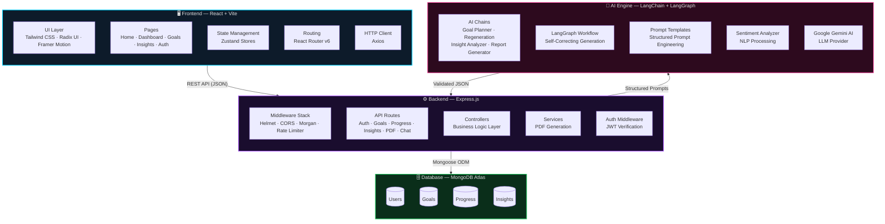
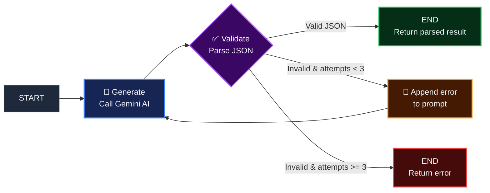
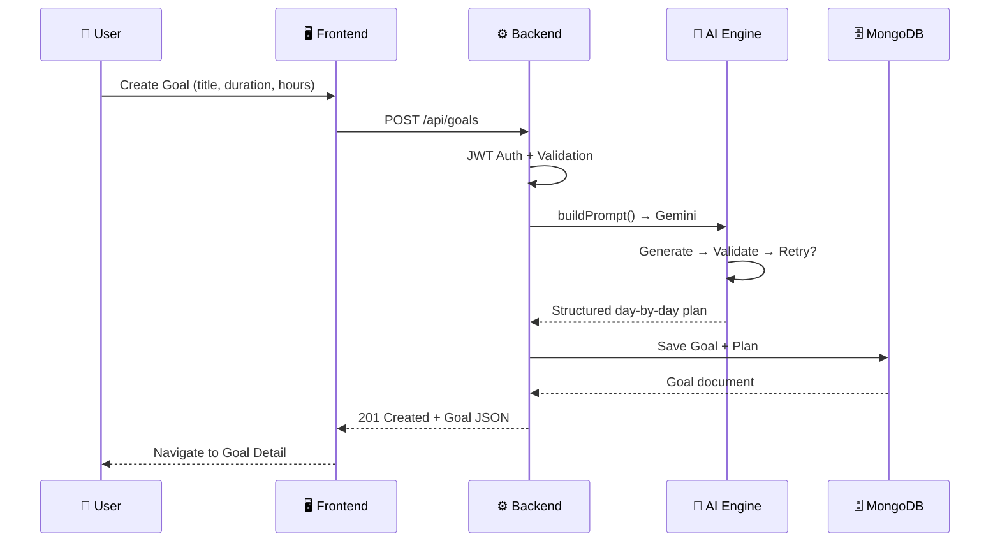
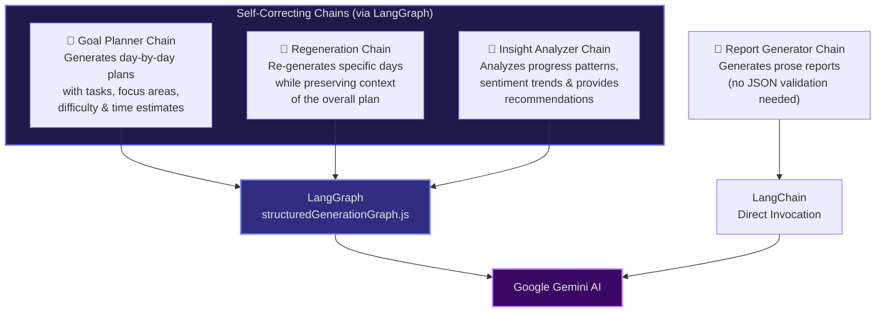
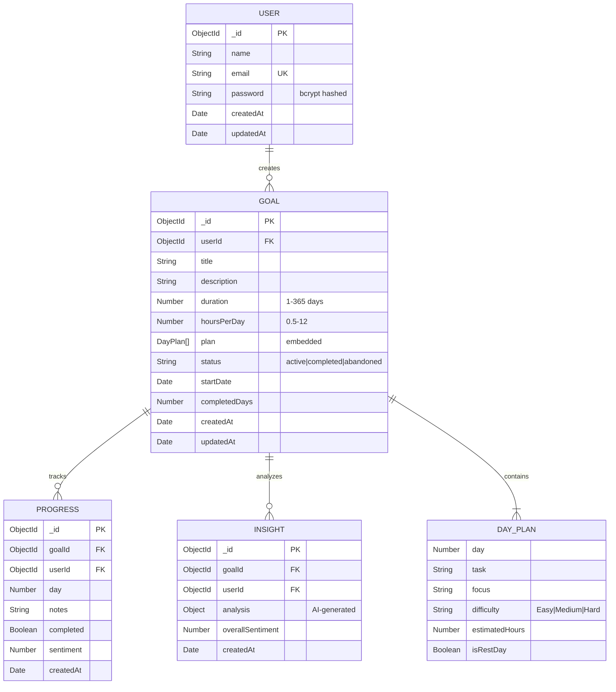

<div align="center">

# 🧠 Aivora

### **AI-Powered Goal Tracking & Productivity Platform**

*Transform your ambitions into actionable, day-by-day plans with the power of AI.*

[](LICENSE)
[](https://nodejs.org)
[](https://react.dev)
[](https://www.mongodb.com)
[](https://vitejs.dev)
[](https://js.langchain.com)
[](https://ai.google.dev)

---

**[🚀 Live Demo](https://aivora-gold.vercel.app)** · **[📖 Documentation](#-getting-started)** · **[🐛 Report Bug](https://github.com/your-repo/aivora/issues)** · **[💡 Request Feature](https://github.com/your-repo/aivora/issues)**

</div>

---

## 📋 Table of Contents

- [Overview](#-overview)
- [Key Features](#-key-features)
- [Architecture](#-architecture)
- [Tech Stack](#-tech-stack)
- [Project Structure](#-project-structure)
- [Getting Started](#-getting-started)
- [Environment Variables](#-environment-variables)
- [API Reference](#-api-reference)
- [AI Engine Deep Dive](#-ai-engine-deep-dive)
- [Frontend Pages & Components](#-frontend-pages--components)
- [Database Schema](#-database-schema)
- [Security](#-security)
- [Deployment](#-deployment)
- [Contributing](#-contributing)
- [License](#-license)

---

## 🌟 Overview

**Aivora** is a full-stack, AI-powered productivity platform that helps users set ambitious goals and automatically generates personalized, day-by-day action plans using **Google Gemini AI**. It combines intelligent planning with progress tracking, sentiment analysis, and AI-driven insights to keep users motivated and on track.

Unlike generic to-do apps, Aivora leverages a **self-correcting AI pipeline** built on **LangChain + LangGraph** that validates its own output and automatically repairs malformed responses — ensuring reliable, structured JSON every single time.

### Why Aivora?

| Problem | Aivora's Solution |
|---|---|
| Setting goals is easy, planning is hard | AI generates a complete day-by-day plan tailored to your schedule |
| Plans feel generic and rigid | Regenerate specific days or the entire plan with one click |
| Hard to measure emotional progress | Sentiment analysis tracks your mood alongside task completion |
| No accountability or insights | AI-powered insights analyze patterns and provide recommendations |
| Boring, static interfaces | Animated, dark-mode-first UI with confetti celebrations 🎉 |

---

## ✨ Key Features

### 🎯 AI Goal Planning
- Describe any goal, set your duration and daily hours — AI creates a structured plan with difficulty levels, focus areas, and estimated time per task.

### 🔄 Self-Correcting AI Pipeline
- Built on **LangGraph**, the AI validates its own JSON output and retries up to 3 times if the response is malformed — no silent failures.

### 📊 Progress Tracking & Analytics
- Track daily task completion with detailed progress logs, completion percentages, and visual charts powered by **Recharts**.

### 🧠 AI-Powered Insights
- Sentiment analysis on your progress notes, pattern detection, and personalized recommendations.

### 💬 AI Chat Assistant
- An in-app conversational assistant for goal-related questions, motivation, and guidance.

### 📄 PDF Report Generation
- Export beautiful, professionally formatted progress reports as PDFs using **PDFKit**.

### 🌗 Dark/Light Theme
- Seamless theme switching with system preference detection, powered by `next-themes`.

### 🎊 Celebration Effects
- Confetti animations when you complete tasks — because small wins deserve to be celebrated!

---

## 🏗 Architecture

### High-Level System Architecture



### LangGraph Self-Correction Flow



### Request Lifecycle



---

## 🛠 Tech Stack

### Frontend

| Technology | Purpose |
|---|---|
| **React 18** | Component-based UI library |
| **Vite 5** | Lightning-fast dev server & bundler |
| **Tailwind CSS 3** | Utility-first CSS framework |
| **React Router v6** | Client-side routing |
| **Zustand** | Lightweight state management |
| **Framer Motion** | Declarative animations |
| **Recharts** | Data visualization / charts |
| **Radix UI** | Accessible, unstyled UI primitives |
| **Lucide React** | Beautiful icon library |
| **Axios** | HTTP client |
| **next-themes** | Theme management (dark/light) |
| **jsPDF** | Client-side PDF generation |
| **react-confetti** | Celebration animations |
| **react-hot-toast** | Toast notifications |

### Backend

| Technology | Purpose |
|---|---|
| **Node.js** | JavaScript runtime |
| **Express 4** | Web application framework |
| **Mongoose 8** | MongoDB ODM |
| **LangChain** | AI/LLM orchestration framework |
| **LangGraph** | Stateful AI workflow graphs |
| **Google Gemini AI** | Large Language Model provider |
| **JWT (jsonwebtoken)** | Authentication tokens |
| **bcrypt.js** | Password hashing |
| **Helmet** | HTTP security headers |
| **Morgan** | HTTP request logging |
| **express-rate-limit** | API rate limiting |
| **express-validator** | Request validation |
| **PDFKit** | Server-side PDF generation |
| **Sentiment** | NLP sentiment analysis |

### Infrastructure

| Technology | Purpose |
|---|---|
| **MongoDB Atlas** | Cloud-hosted database |
| **Vercel** | Frontend deployment |
| **Nodemon** | Development auto-restart |
| **ESLint** | Code linting & quality |

---

## 📁 Project Structure

```
project-Aivora/
│
├── 📄 README.md                          # You are here
│
├── 🖥️  frontend/                          # React + Vite SPA
│   ├── index.html                        # Entry HTML with Google Fonts
│   ├── package.json                      # Frontend dependencies
│   ├── vite.config.js                    # Vite configuration
│   ├── tailwind.config.js                # Tailwind theme & plugins
│   ├── postcss.config.js                 # PostCSS plugins
│   ├── .env                              # VITE_API_URL
│   │
│   ├── public/
│   │   └── favicon.svg                   # App favicon
│   │
│   └── src/
│       ├── main.jsx                      # React DOM entry point
│       ├── App.jsx                       # Root component + route definitions
│       ├── index.css                     # Global styles + Tailwind directives
│       │
│       ├── pages/                        # Route-level page components
│       │   ├── HomePage.jsx              # Landing page with hero & features
│       │   ├── LoginPage.jsx             # User login
│       │   ├── RegisterPage.jsx          # User registration
│       │   ├── DashboardPage.jsx         # Goals overview & stats
│       │   ├── CreateGoalPage.jsx        # AI goal creation form
│       │   ├── GoalDetailPage.jsx        # Day-by-day plan & progress
│       │   └── InsightsPage.jsx          # AI-generated insights & analytics
│       │
│       ├── components/                   # Reusable components
│       │   ├── AuthInitializer.jsx       # Auto-login on app load
│       │   ├── ChatAssistant.jsx         # Floating AI chat widget
│       │   ├── CompletedTasksModal.jsx   # Modal for completed tasks
│       │   ├── ConfettiEffect.jsx        # Celebration confetti
│       │   ├── Loader.jsx               # Loading spinner
│       │   ├── PageLoader.jsx           # Full-page transition loader
│       │   ├── ProgressModal.jsx         # Progress logging modal
│       │   ├── ThemeProvider.jsx         # Dark/light theme wrapper
│       │   ├── ThemeToggle.jsx           # Theme switch button
│       │   │
│       │   └── ui/                       # shadcn-style UI primitives
│       │       ├── button.jsx            # Button variants (CVA)
│       │       ├── card.jsx              # Card layout component
│       │       ├── checkbox.jsx          # Radix checkbox
│       │       ├── input.jsx             # Styled input field
│       │       └── label.jsx             # Radix label
│       │
│       ├── store/                        # Zustand state stores
│       │   ├── authStore.js              # Authentication state
│       │   └── goalStore.js              # Goals state
│       │
│       └── lib/                          # Utilities
│           ├── api.js                    # Axios instance + API functions
│           └── utils.js                  # Helper utilities (cn, etc.)
│
└── ⚙️  backend/                           # Express.js REST API
    ├── package.json                      # Backend dependencies
    ├── .env                              # Environment variables
    ├── .gitignore                        # Git ignore rules
    │
    └── src/
        ├── server.js                     # Express app entry point
        │
        ├── config/                       # App configuration
        │   ├── database.js               # MongoDB connection
        │   └── env.js                    # Environment variable parser
        │
        ├── middleware/                    # Express middleware
        │   ├── auth.js                   # JWT authentication guard
        │   ├── errorHandler.js           # Global error handler
        │   └── rateLimiter.js            # Rate limiting config
        │
        ├── models/                       # Mongoose schemas
        │   ├── User.js                   # User model
        │   ├── Goal.js                   # Goal + DayPlan model
        │   ├── Progress.js               # Progress log model
        │   └── Insight.js                # AI insight model
        │
        ├── routes/                       # API route definitions
        │   ├── auth.routes.js            # POST /register, /login, /me
        │   ├── goal.routes.js            # CRUD + /regenerate
        │   ├── progress.routes.js        # Progress logging endpoints
        │   ├── insight.routes.js         # AI insight generation
        │   ├── pdf.routes.js             # PDF export endpoint
        │   └── chat.routes.js            # AI chat endpoint
        │
        ├── controllers/                  # Route handlers (business logic)
        │   ├── auth.controller.js        # Auth logic
        │   ├── goal.controller.js        # Goal CRUD + AI plan generation
        │   ├── progress.controller.js    # Progress tracking logic
        │   ├── insight.controller.js     # Insight analysis logic
        │   ├── pdf.controller.js         # PDF creation logic
        │   └── chat.controller.js        # Chat message handling
        │
        ├── services/                     # Business services
        │   └── pdf.service.js            # PDFKit report builder
        │
        └── ai/                           # 🤖 AI Engine
            ├── config/
            │   └── model.config.js       # Gemini model initialization
            │
            ├── chains/                   # LangChain chains
            │   ├── goalPlannerChain.js   # Goal → day-by-day plan
            │   ├── regenerationChain.js  # Regenerate specific days
            │   ├── insightAnalyzerChain.js # Progress → insights
            │   └── reportGeneratorChain.js # Generate prose reports
            │
            ├── graphs/                   # LangGraph workflows
            │   └── structuredGenerationGraph.js  # Self-correcting JSON loop
            │
            ├── prompts/                  # Prompt templates
            │   ├── goalPlanner.prompt.js  # Goal planning prompt
            │   ├── regeneration.prompt.js # Plan regeneration prompt
            │   ├── insights.prompt.js     # Insight analysis prompt
            │   └── report.prompt.js       # Report generation prompt
            │
            └── utils/                    # AI utilities
                ├── promptBuilder.js      # JSON parser + prompt helpers
                └── sentimentAnalyzer.js  # NLP sentiment scoring
```

---

## 🚀 Getting Started

### Prerequisites

- **Node.js** ≥ 18.x
- **npm** ≥ 9.x
- **MongoDB** instance (local or [MongoDB Atlas](https://www.mongodb.com/atlas))
- **Google Gemini API Key** ([Get one here](https://makersuite.google.com/app/apikey))

### Installation

#### 1. Clone the repository

```bash
git clone https://github.com/your-username/aivora.git
cd aivora
```

#### 2. Setup Backend

```bash
cd backend
npm install
```

Create your `.env` file:
```bash
cp .env .env.local   # or create a new .env from scratch
```

Configure the environment variables (see [Environment Variables](#-environment-variables) section).

Start the development server:
```bash
npm run dev          # Uses nodemon for hot-reload
```

You should see:
```
╔══════════════════════════════════════════════╗
║   🚀 Aivora API Server                       ║
║                                              ║
║   Environment: development                    ║
║   Port: 5000                                  ║
║   Database: Connected                        ║
║   URL: http://localhost:5000                   ║
╚══════════════════════════════════════════════╝
```

#### 3. Setup Frontend

```bash
cd frontend
npm install
```

Configure the API URL in `.env`:
```env
VITE_API_URL=http://localhost:5000
```

Start the dev server:
```bash
npm run dev          # Vite dev server on :3000
```

#### 4. Open in Browser

Navigate to **http://localhost:3000** and start planning your goals! 🎯

---

## 🔐 Environment Variables

### Backend (`backend/.env`)

| Variable | Description | Default | Required |
|---|---|---|---|
| `PORT` | Server port | `5000` | No |
| `NODE_ENV` | Environment mode | `development` | No |
| `MONGODB_URI` | MongoDB connection string | — | **Yes** |
| `JWT_SECRET` | Secret key for JWT tokens | `your-secret-key` | **Yes** |
| `JWT_EXPIRES_IN` | JWT token expiry duration | `7d` | No |
| `GEMINI_API_KEY` | Google Gemini API key | — | **Yes** |
| `FRONTEND_URL` | Comma-separated allowed origins | `http://localhost:3000` | No |
| `RATE_LIMIT_WINDOW_MS` | Rate limit window (ms) | `900000` | No |
| `RATE_LIMIT_MAX_REQUESTS` | Max requests per window | `100` | No |

### Frontend (`frontend/.env`)

| Variable | Description | Default |
|---|---|---|
| `VITE_API_URL` | Backend API base URL | `http://localhost:5000` |

---

## 📡 API Reference

All API routes are prefixed with `/api`. Protected routes require a `Bearer` token in the `Authorization` header.

### 🔑 Authentication

| Method | Endpoint | Description | Auth |
|---|---|---|---|
| `POST` | `/api/auth/register` | Register a new user | ❌ |
| `POST` | `/api/auth/login` | Login and receive JWT | ❌ |
| `GET` | `/api/auth/me` | Get current user profile | ✅ |

### 🎯 Goals

| Method | Endpoint | Description | Auth |
|---|---|---|---|
| `POST` | `/api/goals` | Create goal + AI plan | ✅ |
| `GET` | `/api/goals` | List all user goals | ✅ |
| `GET` | `/api/goals/:id` | Get goal by ID | ✅ |
| `PUT` | `/api/goals/:id` | Update goal | ✅ |
| `DELETE` | `/api/goals/:id` | Delete goal | ✅ |
| `POST` | `/api/goals/:id/regenerate` | Regenerate AI plan | ✅ |

### 📊 Progress

| Method | Endpoint | Description | Auth |
|---|---|---|---|
| `POST` | `/api/progress` | Log daily progress | ✅ |
| `GET` | `/api/progress/:goalId` | Get progress for a goal | ✅ |

### 🧠 Insights

| Method | Endpoint | Description | Auth |
|---|---|---|---|
| `POST` | `/api/insights/:goalId` | Generate AI insights | ✅ |
| `GET` | `/api/insights/:goalId` | Get insights for a goal | ✅ |

### 📄 PDF Export

| Method | Endpoint | Description | Auth |
|---|---|---|---|
| `GET` | `/api/pdf/:goalId` | Download progress report PDF | ✅ |

### 💬 Chat

| Method | Endpoint | Description | Auth |
|---|---|---|---|
| `POST` | `/api/chat` | Send message to AI assistant | ✅ |

### Health Check

| Method | Endpoint | Description | Auth |
|---|---|---|---|
| `GET` | `/health` | API health status | ❌ |

---

## 🤖 AI Engine Deep Dive

### Chain Architecture

Aivora uses 4 specialized AI chains, 3 of which run through the **LangGraph self-correcting workflow**:



### How Self-Correction Works

1. **Generate** — The LLM receives a structured prompt and produces a response
2. **Parse** — The response is stripped of markdown fences and parsed as JSON
3. **Validate** — A chain-specific validator checks field names, types, and constraints
4. **Retry** — If validation fails, the error message is injected back into the prompt and the model is asked to "repair" its output
5. **Max 3 Attempts** — After 3 failed attempts, the system returns a graceful error

This eliminates the most common failure mode of LLM-powered applications: receiving structurally invalid output.

### Sentiment Analysis

Progress notes are analyzed using the **Sentiment** NLP library, which provides:
- **Polarity scores** (positive/negative)
- **Comparative scores** (normalized by word count)
- Trend tracking over time for the Insights page

---

## 🖥 Frontend Pages & Components

### Pages

| Page | Route | Description |
|---|---|---|
| **Home** | `/` | Animated landing page with feature highlights |
| **Login** | `/login` | User authentication form |
| **Register** | `/register` | New user registration |
| **Dashboard** | `/dashboard` | Goal cards, stats, progress overview |
| **Create Goal** | `/create-goal` | AI-powered goal creation wizard |
| **Goal Detail** | `/goal/:id` | Day-by-day plan, task checkboxes, progress |
| **Insights** | `/insights/:id` | AI analytics, charts, sentiment trends |

### Key Components

| Component | Description |
|---|---|
| `ChatAssistant` | Floating AI chat widget with message history |
| `ProgressModal` | Rich modal for logging daily progress & notes |
| `CompletedTasksModal` | Review completed tasks with details |
| `ConfettiEffect` | Celebratory confetti on task completion |
| `ThemeToggle` | Animated dark/light mode switcher |
| `PageLoader` | Smooth page transition animations |
| `AuthInitializer` | Silent JWT verification on app mount |

### UI Primitives (`components/ui/`)

Built with **Radix UI** + **Class Variance Authority** for accessible, composable components:
- `Button` — Multiple variants (default, destructive, outline, ghost, link)
- `Card` — Container with header, content, footer, title, description
- `Checkbox` — Accessible checkbox with Radix
- `Input` — Styled form input
- `Label` — Accessible form label

---

## 🗃 Database Schema

### Entity Relationship Diagram



### Indexes

| Collection | Index | Purpose |
|---|---|---|
| `goals` | `{ userId: 1, status: 1 }` | Filter active goals per user |
| `goals` | `{ userId: 1, createdAt: -1 }` | Sort by newest first |

---

## 🔒 Security

Aivora implements multiple layers of security:

| Layer | Implementation |
|---|---|
| **Authentication** | JWT tokens with configurable expiry |
| **Password Hashing** | bcrypt with salt rounds |
| **HTTP Headers** | Helmet.js for security headers (XSS, HSTS, etc.) |
| **CORS** | Whitelist-based origin validation |
| **Rate Limiting** | Configurable request limits per IP |
| **Input Validation** | express-validator on all endpoints |
| **Error Handling** | Centralized error handler, no stack traces in production |
| **AI Rate Limiting** | Separate stricter limits on AI endpoints |

---

## 🚢 Deployment

### Frontend (Vercel)

```bash
cd frontend
npm run build        # Produces dist/ folder
# Deploy dist/ to Vercel, Netlify, or any static host
```

Set the environment variable `VITE_API_URL` to your deployed backend URL.

### Backend (Railway / Render / VPS)

```bash
cd backend
npm start            # Runs node src/server.js
```

Ensure all environment variables are configured in your hosting provider's dashboard.

### Production Checklist

- [ ] Set `NODE_ENV=production`
- [ ] Use a strong, unique `JWT_SECRET`
- [ ] Configure `FRONTEND_URL` with your production domain(s)
- [ ] Set appropriate `RATE_LIMIT_*` values for production traffic
- [ ] Enable MongoDB Atlas IP whitelisting
- [ ] Use HTTPS for all endpoints

---

## 🤝 Contributing

Contributions are welcome! Here's how to get started:

1. **Fork** the repository
2. **Create** a feature branch (`git checkout -b feature/amazing-feature`)
3. **Commit** your changes (`git commit -m 'Add amazing feature'`)
4. **Push** to the branch (`git push origin feature/amazing-feature`)
5. **Open** a Pull Request

### Development Guidelines

- Follow ESLint configurations in both frontend and backend
- Write descriptive commit messages
- Keep components focused and reusable
- Add comments for complex AI prompt engineering logic

---

## 📄 License

This project is licensed under the **MIT License** — see the [LICENSE](LICENSE) file for details.

---

<div align="center">

### Built with ❤️ and 🤖

**[⬆ Back to Top](#-aivora)**

</div>
