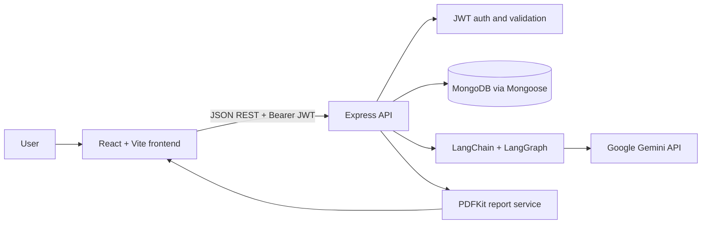
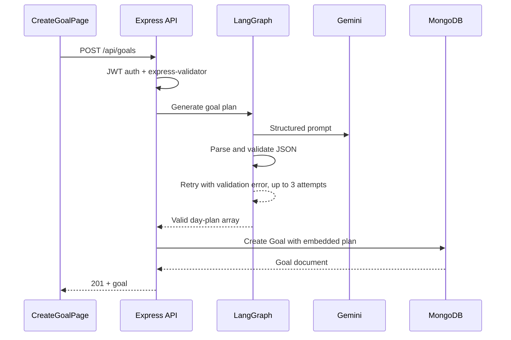
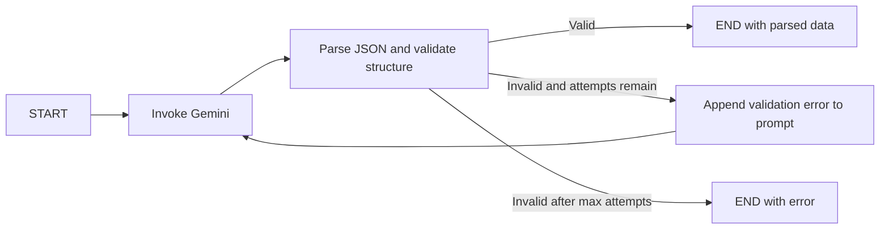

# Aivora Architecture

## System Overview

Aivora is a full-stack goal planning and progress-tracking application. The frontend is a React single-page application served by Vite. It communicates with a Node.js/Express REST API, which authenticates users, owns business logic, persists data in MongoDB, invokes Google Gemini for AI features, and streams generated PDF reports back to the browser.



The main product workflow is:

1. A user registers or logs in and receives a signed JWT.
2. The user submits a goal, duration, and daily time budget.
3. The API asks Gemini for a structured day-by-day plan, validates the response, and stores the goal and embedded plan.
4. The user records daily completion, comments, and time spent.
5. The API calculates progress and local sentiment scores from comments.
6. The user can regenerate the remaining plan, generate historical AI insights, chat with the support assistant, or download a PDF report.

## Tech Stack

### Frontend

- React 18 with React DOM
- Vite 5 for development and production bundling
- React Router 6 for client-side routes
- Axios for REST requests
- Zustand with persistence for authentication state; a goal store is also available for shared goal state
- Tailwind CSS, Radix UI primitives, and class-variance-authority for UI composition
- Framer Motion for transitions and interaction animation
- Recharts for progress and insight visualizations
- `next-themes` for dark/light/system theme handling
- `react-confetti`, `lucide-react`, and `react-hot-toast` for presentation and feedback

### Backend

- Node.js 18+ using native ES modules
- Express 4 for the HTTP API
- Mongoose 8 for MongoDB access and schema validation
- `jsonwebtoken` for JWT creation and verification
- `bcryptjs` for password hashing and comparison
- `express-validator` for request validation
- Helmet, CORS, Morgan, and `express-rate-limit` for baseline API security and operations
- PDFKit for server-side PDF generation
- Sentiment for local natural-language sentiment scoring

### AI

- LangChain core and `@langchain/google-genai` for model invocation
- LangGraph for the reusable generate/validate/retry workflow
- Google Gemini `gemini-2.5-flash` as the configured model
- Separate model factories provide normal and lower-temperature calls for planning/analysis and fast responses

### Infrastructure and current integrations

- MongoDB, normally MongoDB Atlas in the documented production setup
- Vercel is the documented frontend deployment target
- The README documents Render, Railway, or a VPS as backend options; the deployed frontend currently contains a Render API URL for PDF downloads
- No payment provider, email provider, analytics platform, object storage, queue, or hosted monitoring integration is implemented in the source tree

## Project Structure

```text
project-Aivora/
├── architecture.md              # This architecture document
├── README.md                    # Product, setup, API, and deployment notes
├── frontend/
│   ├── src/main.jsx             # React DOM entry point
│   ├── src/App.jsx              # Theme, auth bootstrap, routes, global chat
│   ├── src/pages/               # Home, auth, dashboard, goal, and insight views
│   ├── src/components/          # Reusable workflow, loading, theme, and UI components
│   ├── src/store/               # Zustand auth and goal stores
│   ├── src/lib/api.js           # Shared Axios client and endpoint methods
│   └── public/                  # Static assets
└── backend/
    └── src/
        ├── server.js            # Express setup, middleware, routes, startup
        ├── config/              # Environment parsing and MongoDB connection
        ├── middleware/          # JWT auth, rate limiting, async/error handling
        ├── routes/              # HTTP route declarations and validators
        ├── controllers/         # Request orchestration and business rules
        ├── models/              # Mongoose User, Goal, Progress, and Insight models
        ├── services/            # PDFKit report construction
        └── ai/
            ├── config/          # Gemini model factories
            ├── chains/          # Planner, regeneration, insight, and report chains
            ├── graphs/           # Structured generation retry graph
            ├── prompts/          # Feature-specific prompt builders
            └── utils/            # JSON parsing/validation and sentiment analysis
```

The backend follows a route -> middleware -> controller -> model/service/AI dependency flow. Controllers are the orchestration layer; there is no separate repository or service layer for goal, progress, or insight CRUD today.

## Frontend Application Flow

`frontend/src/main.jsx` mounts `App`. `App` installs the theme provider and browser router, runs `AuthInitializer`, mounts global loading UI, and renders the floating `ChatAssistant` alongside the route tree.

The main routes are:

| Route                 | Responsibility                                                           |
| --------------------- | ------------------------------------------------------------------------ |
| `/`                   | Product home page                                                        |
| `/login`, `/register` | Credential authentication                                                |
| `/dashboard`          | Lists the authenticated user's goals and aggregates progress             |
| `/create-goal`        | Collects goal details and starts AI plan generation                      |
| `/goal/:id`           | Shows the plan, records progress, regenerates plans, and exports reports |
| `/insights/:id`       | Loads charts and insight history and requests new AI insights            |

The shared Axios client defaults to `VITE_API_URL` or `http://localhost:5000/api`. Its request interceptor reads `auth_token` from `localStorage` and adds an `Authorization: Bearer ...` header. A 401 response clears the token and redirects to `/login`. Auth state is persisted by Zustand under `auth-storage` and synchronized with the token in local storage at application startup.

## Backend Request Pipeline

The server applies, in order:

1. Helmet security headers.
2. Whitelist-based CORS using `FRONTEND_URL` values.
3. Morgan request logging.
4. JSON and URL-encoded body parsing.
5. A general rate limiter on `/api`.
6. Route-specific authentication, validation, and stricter limits where applicable.
7. A JSON 404 response for unknown routes.
8. The centralized error handler.

The server connects to MongoDB before listening. `/health` is public and returns a simple API status. Protected routes use `authenticate`, which verifies the JWT, loads the user without the password field, and attaches `req.user` and `req.userId` for ownership checks.

## Data Flow

### Authentication

1. The frontend posts credentials to `/api/auth/register` or `/api/auth/login`.
2. The route validates the input. Registration creates a user after the Mongoose `pre('save')` hook hashes the password with bcrypt.
3. Login loads the password explicitly, compares it with bcrypt, and signs a JWT containing the user ID.
4. The frontend persists the token and sends it on subsequent requests.
5. `/api/auth/me` and all private controllers validate the token and enforce user ownership.

### Goal creation and regeneration



`POST /api/goals/:id/regenerate` loads the user's goal and progress, computes completed and remaining days, asks Gemini for a replacement plan, renumbers the generated days, and preserves the completed prefix of the original plan.

### Progress tracking

`POST /api/progress` first verifies that the goal belongs to the authenticated user. If a comment exists, the local Sentiment library produces a normalized score from -1 to 1. The request then creates or updates the unique `(goalId, day)` progress entry, recounts completed days, updates `Goal.completedDays`, and marks the goal completed when the count reaches its duration. Progress statistics are calculated on demand from stored entries rather than from a separate aggregate collection.

### Insights

`POST /api/insights/generate/:goalId` verifies ownership, loads progress ordered by day, and rejects goals with no progress. The insight chain asks Gemini for structured output containing a summary, mood trend, motivation level, blockers, recommendations, and highlights. Each successful generation is stored as a new `Insight` document, preserving historical results. The insights page can then retrieve all results or the latest result.

### Chat

`ChatAssistant` maintains the conversation in frontend component state and sends the current message plus history to `POST /api/chat/support`. The authenticated controller builds a product-focused system prompt, includes the user name and conversation history, calls the fast Gemini model, and returns a text reply. Conversation history is not persisted in MongoDB.

### PDF reports

`GET /api/pdf/goal/:goalId/report` verifies ownership, loads the goal, progress, and latest insight, calculates report statistics, and passes plain objects to the PDFKit service. The service writes the overview, statistics, recent completed progress, and available insight data to a PDF stream. The controller sets `Content-Type: application/pdf` and an attachment filename, allowing the browser to download the response.

## Database and Storage

MongoDB is the only persistent storage system. Mongoose creates the following logical collections:

| Entity     | Key data and relationships                                                                                                              |
| ---------- | --------------------------------------------------------------------------------------------------------------------------------------- |
| `User`     | Name, unique normalized email, bcrypt-hashed credentials, optional provider metadata, timestamps                                        |
| `Goal`     | Owner, title, description, duration, hours per day, status, dates, completed count, and an embedded `plan[]` of daily tasks             |
| `Progress` | Goal/user references, unique day per goal, completion, comment, sentiment score, hours spent, and timestamps                            |
| `Insight`  | Goal/user references, week number, AI summary, mood trend, motivation level, blockers, recommendations, highlights, and generation time |

Important indexes include user/status and user/createdAt on goals, goal/day uniqueness and user/timestamp on progress, and goal/generatedAt and user/generatedAt on insights. Deleting a goal also deletes its associated progress entries. Insights are retained independently and are not automatically deleted by the goal controller.

There is no file or object-storage layer. PDF reports are generated in memory and streamed directly to the HTTP response; they are not saved on the server.

## AI Architecture

The planner, regeneration, and insight chains share `structuredGenerationGraph.js`:



The graph defaults to three attempts. Plan validation checks the array and daily task fields; insight validation checks the required object fields. The report generator is separate and directly invokes Gemini for prose, without the structured retry graph. Model API keys stay on the backend and are read from environment configuration.

## External Services and Integrations

- **Google Gemini:** AI planning, plan regeneration, structured insight generation, report prose support, and authenticated support chat. Configured with `GEMINI_API_KEY`.
- **MongoDB/MongoDB Atlas:** Primary database, configured with `MONGODB_URI`.
- **Browser local storage:** Stores the JWT token and persisted Zustand auth state; this is client storage, not a server integration.
- **Vercel/Render or similar hosts:** Deployment targets documented by the project. These are hosting choices rather than application SDK integrations.

OpenAI and Groq keys are parsed by `backend/src/config/env.js`, but no current chain uses those providers. Payments, email, product analytics, error monitoring, background workers, and cache infrastructure are not implemented.

## Security and Reliability Boundaries

- Passwords are never selected in normal user queries and are removed from serialized user objects.
- Private controllers scope queries by `req.userId` and verify goal ownership before accessing goal-related data.
- CORS origins are configured rather than globally open.
- Helmet adds standard HTTP security headers.
- General, authentication-specific, and AI-specific rate limits protect different cost and abuse surfaces.
- Request validation and Mongoose schema validation provide input checks at two layers.
- AI JSON is parsed and structurally validated before plans or insights are persisted.
- Production errors omit stack traces; development responses may include them.

Operational considerations for production include replacing the default JWT secret, keeping API keys server-side, using HTTPS, ensuring frontend and backend API URLs share the same deployment configuration, and avoiding sensitive request/token logging. The Axios client currently logs token-existence information and request metadata in the browser, and the goal detail page has a hardcoded Render URL for PDF downloads; these should be centralized through `VITE_API_URL` before deploying to multiple environments.

## Deployment

### Local development

- Backend: from `backend/`, run `npm install` then `npm run dev`; default port is 5000.
- Frontend: from `frontend/`, run `npm install` then `npm run dev`; Vite is configured for port 3000.
- Frontend `VITE_API_URL` should point to the backend API base URL.
- Backend requires `MONGODB_URI`, `JWT_SECRET`, and `GEMINI_API_KEY`; `FRONTEND_URL` controls allowed browser origins.

### Production options

The documented options are:

1. Build the Vite frontend with `npm run build` and deploy the generated `frontend/dist` to Vercel, Netlify, or Cloudflare Pages.
2. Run the Node backend with `npm start` on Render, Railway, a VPS, or AWS EC2. The README also describes an EC2 deployment with PM2, Nginx, and Let's Encrypt.
3. Use MongoDB Atlas with network access restricted to the backend deployment.
4. Configure the deployed frontend origin in `FRONTEND_URL` and the backend API URL in `VITE_API_URL`.

The backend is a state-light HTTP process apart from MongoDB and Gemini calls, so multiple instances are possible after centralizing configuration and adding production-grade shared rate limiting and observability.

## Scalability Notes and Future Considerations

Current behavior is synchronous: AI generation, statistics queries, and PDF assembly complete during the request. This is suitable for a small deployment, but longer AI calls can occupy API workers and a large dashboard currently fetches progress separately for each goal.

Recommended next steps as usage grows:

- Move goal creation, regeneration, insight generation, and PDF generation to a queue-backed worker model; return job status to the UI.
- Add shared rate-limit storage, such as Redis, when running more than one backend instance.
- Cache frequently read dashboard and latest-insight data with short, user-scoped TTLs.
- Add pagination for goals, progress, and insight history, plus compound indexes based on production query profiles.
- Add a bulk progress endpoint or server-side dashboard aggregation to avoid one progress request per goal.
- Add structured logs, request IDs, metrics, uptime checks, and error monitoring; none is currently wired into the application.
- Add retention and privacy policies for user prompts, progress comments, AI outputs, and generated reports.
- Store generated reports in object storage only if durable downloads or asynchronous report retrieval becomes a requirement.
- Add automated tests around ownership checks, AI validation/retry behavior, progress completion transitions, and PDF response handling.
